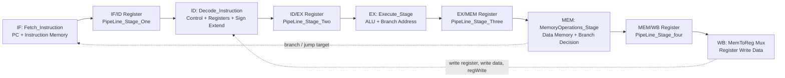
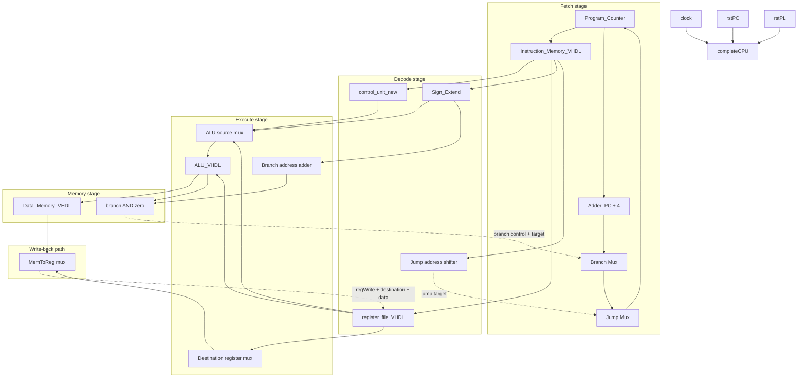
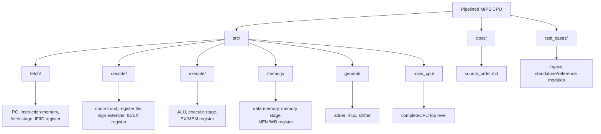

# Pipelined MIPS CPU in VHDL

This repository contains a 32-bit pipelined MIPS-style CPU written in VHDL for Xilinx ISE Design Suite on Windows 10 and Windows 11.

The main design is a five-stage pipeline:

1. Instruction Fetch
2. Instruction Decode / Register Read
3. Execute / ALU
4. Memory Access
5. Write Back

The top-level entity is `completeCPU` in `src/main_cpu/completeCPU.vhd`.

## Architecture Diagrams

GitHub renders these diagrams with Mermaid. If you are viewing the README in a plain text editor, the code blocks still describe the same connections.

### Pipeline Overview



### Top-Level Data Flow



### Source Organization



## Features

- 32-bit data path and instruction width
- Active-high reset signals
- Pipeline registers between fetch/decode, decode/execute, execute/memory, and memory/write-back
- Register file with 32 registers and protected `$zero`
- Word-addressed instruction and data memories
- Hard-coded instruction ROM and initialized data RAM for simulation/demo runs
- Debug outputs from the top-level CPU for observing the pipeline state

## Supported Instructions

The pipelined design currently supports:

- R-type: `ADD`, `SUB`, `AND`, `OR`, `SLT`, `NOP`
- I-type: `ADDI`, `LW`, `SW`, `BEQ`
- J-type: `J`

ALU control encoding used by the pipelined CPU:

| Code | Operation |
| --- | --- |
| `000` | AND |
| `001` | OR |
| `010` | ADD |
| `011` | NOP |
| `110` | SUB |
| `111` | SLT |

## Repository Layout

```text
src/
  decode/       Instruction decode, control unit, register file, sign extender, ID/EX pipeline register
  execute/      ALU, execute stage, EX/MEM pipeline register
  fetch/        Program counter, instruction memory, fetch stage, IF/ID pipeline register
  general/      Shared adder, mux, and shifter components
  main_cpu/     Top-level completeCPU entity
  memory/       Data memory, memory stage, MEM/WB pipeline register
test_cases/     Older standalone/reference modules used during development
docs/           Build notes and source import order
```

`test_cases/` contains legacy/reference modules with some duplicate entity names. Do not compile those files in the same ISE project as `src/` unless you intentionally isolate them in a separate test project.

## Importing in Xilinx ISE

1. Create a new VHDL project in ISE.
2. Add only the files under `src/`.
3. Use the compile order in `docs/source_order.md`.
4. Set `completeCPU` as the top-level entity.
5. Simulate or synthesize from the top level.

## Top-Level Ports

`completeCPU` exposes the main clock/reset inputs plus debug outputs for:

- Fetch-stage PC and instruction
- Execute-stage ALU result
- Memory-stage read data
- Write-back data
- Decode-stage control signals and decoded register/immediate values

These outputs make it easier to inspect pipeline behavior in the ISE simulator.

## Current Limitations

- No hazard detection, stalling, flushing, or forwarding unit is implemented yet.
- Instruction memory is initialized directly inside `Instruction_Memory_VHDL.vhd`.
- Data memory is initialized directly inside `Data_Memory_VHDL.vhd`.
- The project is written for clarity and coursework-style simulation first; timing closure and FPGA board integration are not included.

